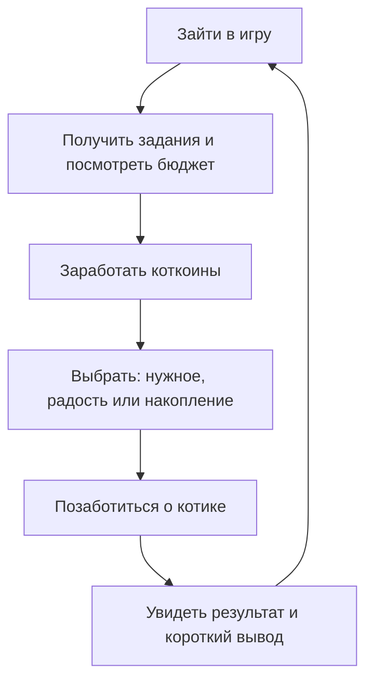

# Игровой сценарий: финансовая грамотность с виртуальным питомцем

## 1. Цель игры

Игра помогает детям 7–11 лет в безопасной и доброжелательной форме понять, что деньги ограничены, у трат есть приоритеты, а накопление и планирование помогают достигать целей. Ребёнок заботится о котике, зарабатывает **коткоины**, выбирает, на что их потратить, и видит спокойные, понятные последствия своих решений.

### Важные принципы

- Питомец никогда не пугает ребёнка, не «болеет страшно» и не остаётся без помощи.
- Нет стыда, насмешек, обесценивания и необратимых потерь. Ошибка — повод попробовать ещё раз и узнать новое.
- Никаких механик, подталкивающих к срочной покупке или вызывающих страх «упустить». Все условия и цены понятны заранее.
- Реальные финансовые темы объясняются через игровые образы: «котодерево-копилка», «план здоровья», «бюджет на день».
- Игра не наказывает ребёнка за пропуск дня: возвращение всегда тёплое и простое.

## 2. Основной игровой цикл

Один игровой день соответствует одному календарному дню. Внутри него есть три спокойных момента: утро, день и вечер. Ребёнок сам выбирает, когда зайти; обязательного присутствия в конкретный час нет.

В конце дня котик говорит одну короткую фразу без оценки личности ребёнка, например: «Мы купили нужное и оставили 20 коткоинов на цель. Хороший план!» После нескольких дней или завершения большой цели ребёнок может пройти «проверку-приключение» и открыть следующий уровень.

## 3. Игровая валюта и бюджет

**Коткоины** ребёнок получает за мини-игры, задания и регулярное посещение. На главном экране всегда видно:

- сколько коткоинов есть сейчас;
- ближайшая цель накопления;
- обязательные и необязательные траты на сегодня;
- состояние котика: сытость, энергия и радость.

### Категории трат

| Категория | Примеры | Чему учит |
| --- | --- | --- |
| Нужное | обычная еда, уход, плановый осмотр | сначала закрывать важное |
| Полезное | полезная еда, спортивная активность, саженец | забота о себе и планирование |
| Радость | игрушка, бантик, мини-развлечение | в бюджете должно быть место для приятного |
| Накопление | котодерево-копилка, большая цель | ждать ради большей цели |

## 4. Цены в магазине

Цены могут меняться не более двух раз в сутки: утром и вечером. Но ребёнок заранее видит на табличке, когда будет следующее обновление: «Вечерние цены появятся после 18:00». Это не случайная тревожная распродажа, а понятное событие игры.

Изменения небольшие и не затрагивают базовые нужды: простая еда и необходимый уход всегда доступны по стабильной цене. Меняться могут цены на дополнительные товары, украшения и особые лакомства. Так ребёнок учится сравнивать варианты, но не сталкивается с ощущением дефицита.

## 5. Забота о питании и здоровье

### Питание

Не используем формулировки «толстый», «некрасивый» или визуальное высмеивание питомца. Если часто выбирать только фастфуд, котик остаётся милым, но может стать менее бодрым: ему сложнее бегать и играть. Игра мягко предлагает разнообразить меню.

Полезный выбор не должен быть единственно «правильным». Иногда лакомство — нормальная часть радости. Важно показать баланс: обычная еда поддерживает сытость, полезная — энергию, а любимое лакомство иногда поднимает настроение.

### Активность

Варианты активности:

- бесплатная прогулка или домашняя игра;
- недорогая спортивная повязка и напульсники как косметическая награда;
- беговая дорожка как большая цель;
- спортивный клуб в формате «кроличьей норы»: котик заходит в дверь, проходит короткая анимация, затем выходит бодрым. Полный интерьер и тренировка не нужны.

Так ребёнок видит: о здоровье можно заботиться разными способами, в том числе бесплатными.

### Ветеринар

Ветеринар — добрый помощник, а не источник страха. Есть три формата визита:

| Визит | Когда доступен | Что происходит | Финансовый урок |
| --- | --- | --- | --- |
| Плановый осмотр | регулярно | короткая позитивная проверка | маленькие регулярные траты помогают заботиться заранее |
| Чек-ап | раз в 10 реальных дней | расширенная проверка и совет | полезно предусматривать крупную обязательную трату |
| Срочная консультация | только как мягкий учебный сценарий | ветеринар сразу помогает; котик не страдает | у непредвиденных расходов полезно иметь запас |

Если игрок долго не выбирает чек-ап, не нужно доводить котика до пугающего состояния или блокировать игру. Вместо этого появляется спокойное сообщение: «Котику пригодится совет ветеринара. Давай запланируем визит?» До посещения может немного снижаться бонус энергии или радости, но все основные действия остаются доступными.

Не стоит предлагать ребёнку кредит с высоким процентом как наказание. Для первой версии лучше использовать «резерв помощи»: если денег не хватает на нужный визит, игра даёт беспроцентную поддержку и затем на простом примере объясняет, зачем откладывать небольшой резерв. Тему кредита и процентов можно добавить позже, только в старшей сложности, как отдельную добровольную симуляцию без штрафа и давления.

## 6. Котодерево-копилка — механика накопления

Ребёнок покупает саженец и высаживает его. Через время на нём появляются коткоины. Это игровой образ вклада: деньги работают, если дать им время.

| Саженец | Срок ожидания | Награда | Смысл |
| --- | ---: | ---: | --- |
| Обычный | 5 / 10 / 15 дней | маленькая / средняя / большая | дольше ждать — больше результат |
| Редкий | 7 / 12 / 17 дней | больше, чем у обычного | больший стартовый вклад даёт больший итог |

Ребёнок может собрать коткоины раньше срока, но получает меньшую награду. Перед выбором игра ясно показывает оба варианта: «Собрать сейчас: 30» и «Подождать 5 дней: 50». Это учит сравнивать, а не угадывать.

После сбора есть три равноправных решения:

1. Купить такой же саженец и часть потратить на другие цели.
2. Купить более дорогой саженец ради большей будущей награды.
3. Пока не сажать новый и потратить коткоины на текущие нужды или радость.

Третий вариант не подаётся как ошибка: игра лишь объясняет, что без нового саженца временно не будет пассивного дохода. Накопление можно начать снова в любой момент.

## 7. Ежедневное посещение

За вход ребёнок получает маленький подарок и растущую серию: на 7-й день открывается максимальный ежедневный бонус. Он сохраняется, пока посещения регулярны. Награды могут заметно расти, например: 2 → 3 → 5 → 7 → 10 → 14 → 20 коткоинов. Ребёнок видит всю линейку заранее и понимает, почему регулярность помогает приблизиться к цели.

При пропуске серия не должна обнуляться. Рекомендуемый вариант: она мягко уменьшается на один уровень, например с 7 до 6. Котик встречает ребёнка без упрёка: «Рад тебя видеть! Продолжим с того места, где остановились». Так регулярность поощряется, но игра не создаёт чувство вины.

## 8. Как зарабатывать коткоины

Деньги не появляются «просто так»: основная часть зарабатывается в коротких мини-играх. Каждая занимает 1–3 минуты и может быть пройдена повторно с помощью.

### 8.1. Работа бухгалтера

Котик помогает маленькому магазину посчитать сдачу, сложить цены или распределить бюджет.

- Правильный ответ даёт полную награду и звёздочку мастерства.
- Ошибка не отнимает заработанное: ребёнок получает базовую награду, подсказку и может исправить ответ.
- Вместо «минуса к зарплате» действует бонус за точность. Это стимулирует учиться, но не расстраивает.

### 8.2. Мастерская самоцветов

Ребёнок покупает учебный камень, очищает его от пыли и затем продаёт. Аккуратная работа увеличивает бонус к цене. Если движение было неудачным, не нужно превращать покупку в убыток: камень сохраняет базовую стоимость, а помощник предлагает потренироваться на бесплатном образце.

Урок: вложение ресурсов, аккуратный труд, себестоимость и результат работы.

### 8.3. Дополнительные задания

Небольшие задания связывают деньги с жизненными ситуациями: выбрать продукты в рамках бюджета, отложить часть награды на цель, сравнить два товара по цене и пользе. Для выполнения не требуется реальная покупка или ввод личных данных.

### 8.4. Котомаркет: собери корзину

Котик собирается на прогулку, готовит праздник или ухаживает за домиком. Ребёнок получает список из 2–4 нужных вещей и ограниченный бюджет. На полках лежат необходимые покупки (обычный корм, лекарство, когтеточка) и желаемые покупки (золотая мышка, премиум-лежанка, украшение).

Задача — перетянуть товары в корзину, сначала закрыть нужное и уложиться в коткоины. После выбора ребёнок видит простой итог: «Нужное купили, 12 коткоинов осталось. Их можно отложить в копилку или потратить на радость».

- Нет единственного «правильного» набора: при нескольких удачных решениях игра объясняет плюсы каждого.
- Если в корзине только «хотелки», на кассе котик спокойно напоминает: «Сначала добавим корм — он нужен каждый день». Покупка ещё не подтверждена, поэтому ребёнок может изменить выбор без потери коткоинов.
- Если бюджета не хватило, котик предлагает безоценочно изменить план: выбрать другой вариант, убрать необязательный товар или заработать недостающую сумму в другом задании.
- Базовая награда выдаётся за завершение, а звёздочка планировщика — за соблюдение бюджета и разумный остаток.

**Чему учит:** отличать нужное от желаемого, сравнивать товары, не выходить за бюджет и оставлять небольшой запас.

### 8.5. Сравни магазины

Котику нужно купить корм, лекарство или когтеточку. На экране одновременно открыты три магазина с яркими карточками: обычный, средний и премиум. У каждого есть цена, скидка, условия доставки и срок получения.

Примеры заданий:

- «Лапки-маркет»: корм 3 коткоина + доставка 1 коткоин.
- «КотоДом»: корм 5 коткоинов, но второй такой же — бесплатно.
- «Премиум-лапа»: корм 4 коткоина, доставка бесплатная, но подарок — только украшение.

Ребёнок нажимает на корзину магазина и видит **итоговую сумму до оплаты**. Он может посчитать сам или включить подсказку: «3 + 1 = 4». При нескольких покупках игра предлагает проверить условие «второй бесплатно» и сравнить не яркость вывески, а окончательную цену и нужность товара.

**Чему учит:** сравнивать полную стоимость, замечать доставку и скидки, не выбирать товар только из-за красивой рекламы.

## 9. Шкала радости

У котика есть шкала радости. Она напоминает: бюджет нужен не только для обязательных трат и больших целей, но и для небольших приятных вещей.

- Маленькая радость доступна каждый день: игра вместе, прогулка, украшение, любимое лакомство.
- Не все приятные действия платные: часть из них бесплатна.
- При очень низкой радости котик не «грустит постоянно» и не лишает ребёнка награды; может лишь немного снизиться бонус к эффективности в мини-играх.
- Возвратить радость можно быстро и недорого. Игра объясняет: «Отдых и удовольствие тоже можно планировать».

## 10. Разделение по возрасту

| Элемент | 7–8 лет: лёгкий уровень | 9–11 лет: средний уровень |
| --- | --- | --- |
| Числа | небольшие суммы, сложение до 20 | бюджет из нескольких статей, сравнение вариантов |
| Выбор | один выбор за раз, наглядные иконки | 2–3 варианта и объяснение последствий |
| Копилка | один саженец, короткие сроки | несколько саженцев, сравнение дохода и срока |
| Магазин | стабильные базовые цены | небольшие плановые изменения цен |
| Ветеринар | напоминание и готовая рекомендация | планирование чек-апа и резерв на непредвиденное |
| Кредиты | не показываются | отдельная добровольная учебная симуляция |
| Обратная связь | голос/анимация и короткая фраза | короткий вывод: «что выбрали — почему это помогло» |

## 11. Проверка перед следующим уровнем

Переход оформлен как короткое приключение: котик приходит к «Поляне знаний» и помогает персонажам принять решения. Это не школьный экзамен и не блокировка: ребёнок может пройти его позже, повторить сколько угодно раз или воспользоваться подсказкой.

Проверка состоит из 3–5 интерактивных карточек, по одной теме за раз. Вместо оценки «не сдал» после ответа появляется объяснение и возможность выбрать снова.

Примеры карточек:

| Тема | Игровой вопрос | Что должен понять ребёнок |
| --- | --- | --- |
| Котодерево | «Собрать 30 сейчас или 50 через 5 дней?» | накопление приносит больше не мгновенно, а со временем |
| Бюджет | «Что положить в корзину сначала: корм или золотую мышку?» | нужное важнее желаемого |
| Магазины | «Где итог меньше: 3 + доставка 1 или цена 5?» | сравнивать нужно полную цену |
| Резерв | «Почему оставить несколько коткоинов?» | запас помогает при неожиданной нужной трате |

Когда базовые идеи понятны, открывается следующий уровень с более крупными суммами, несколькими вариантами и новыми заданиями. Ребёнок получает значок «Умный планировщик», а не балл или рейтинг.

## 12. Учебная симуляция кредита — только для 9–11 лет

Кредит не должен быть способом наказать за пропущенный чек-апп или нехватку на еду. Это отдельный безопасный сценарий в «Городе финансов»: котик хочет купить необязательный предмет, а ребёнок сравнивает предложения и видит, сколько придётся вернуть в итоге. Все суммы игрушечные, а после задания долг автоматически закрывается — в основной игре не остаётся реальных ограничений.

Перед выбором каждая карточка показывает четыре одинаково заметных поля: «получу сейчас», «верну всего», «доплата», «когда верну». Нельзя подписать договор, не открыв условия.

| Предложение | Условия в игре | Учебный вывод |
| --- | --- | --- |
| Банк кота Леопольда | маленькая доплата, всё написано крупно и понятно; деньги через 1–2 игровых дня | прозрачные условия и время ожидания часто безопаснее |
| Банк кота Базилио | деньги сегодня или завтра; на витрине привлекательная ставка, но в договоре есть комиссия | нужно читать все условия и считать **итоговую** сумму, а не верить одному числу |
| Собачий займ | деньги сразу, очень большая доплата и короткий срок | срочность и мгновенные деньги могут стоить слишком дорого; лучше искать другой вариант или копить |

После решения игра не говорит «ты ошибся». Она показывает сравнение на числах и предлагает переиграть: «У Леопольда вернём 12, у Базилио — 15 с комиссией, у Собачьего займа — 22. Какой вариант теперь кажется разумнее?»

Главный вывод модуля: кредит — не дополнительный доход; это деньги, которые нужно вернуть с доплатой. В большинстве обычных ситуаций лучше планировать покупку, накопить или выбрать более доступный вариант.

## 13. Визуальный стиль и интерактивность

Интерфейс должен ощущаться как яркий и живой мир котика, а не как учебный тест:

- крупные понятные карточки с иконками, короткими подписями и озвучкой по кнопке;
- действия пальцем: перетянуть товар в корзину, посадить саженец, собрать коткоины, открыть условия договора;
- добрые микроанимации: котик радуется удачному плану, монетки мягко летят в кошелёк, саженец растёт по дням;
- обратная связь без красных крестиков и тревожных звуков: подсветка, подсказка, «Давай проверим ещё раз»;
- контрастные цвета и не только цвет: важные различия дублируются иконкой и текстом;
- без рекламы, таймеров давления и внешних покупок.

## 14. Что включить в MVP

Чтобы первая версия была выполнимой, достаточно собрать одну рабочую петлю:

1. Котик, кошелёк коткоинов, сытость, энергия и радость.
2. Магазин с 9–11 товарами и понятными категориями.
3. Две интерактивные мини-игры: «Бухгалтер» и «Котомаркет: собери корзину».
4. Обычный саженец-копилка с тремя сроками.
5. Ежедневная награда без жёсткого обнуления серии.
6. Плановый визит к ветеринару с мягкими напоминаниями.
7. Экран короткого итога дня.

После первой проверки MVP с детьми и родителями приоритетно добавить «Сравни магазины», проверку-приключение и более сложный уровень. Самоцветы, спортивный клуб, редкие саженцы, вечерние цены и учебную симуляцию кредита — после этого.

## 15. Вопросы для команды перед разработкой

- Какой один главный навык проверяем в первой версии: бюджет, накопление или приоритеты?
- Сколько коткоинов ребёнок в среднем зарабатывает за день и сколько дней копит на каждую большую цель?
- Какие объяснения будут текстом, а какие — голосом и анимацией?
- Как родитель увидит прогресс ребёнка без оценок и сравнения с другими детьми?
- Какие действия всегда бесплатны, чтобы игра не учила, что забота и радость бывают только за деньги?

## 16. Ключевые улучшения исходного сценария

1. Заменить наказания за ошибки, пропуски и медицинские решения на мягкие последствия, подсказки и возможность исправиться.
2. Отказаться от образа «не милого толстого котика» и от кредитов с высоким процентом как санкции.
3. Сделать изменения цен предсказуемыми и не затрагивать необходимые товары.
4. Показывать ценность здоровья, радости и накоплений как баланс, а не как соревнование за максимум коткоинов.
5. Добавить проверку-приключение перед сложными уровнями: она объясняет и закрепляет знания без школьной оценки.
6. В старшем уровне показать кредиты как учебную симуляцию с полной стоимостью, комиссиями и правом переиграть выбор.
7. Сделать мини-игры живыми и наглядными: перетаскивание, карточки магазинов, анимации и озвучиваемые подсказки.
8. Сначала реализовать небольшую, завершённую петлю MVP, затем расширять её только после тестирования.