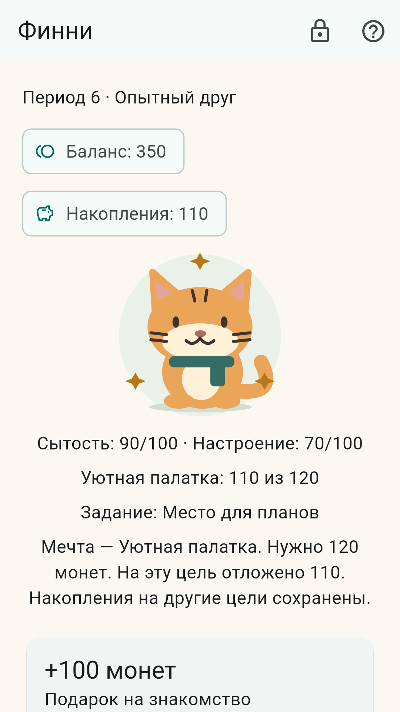
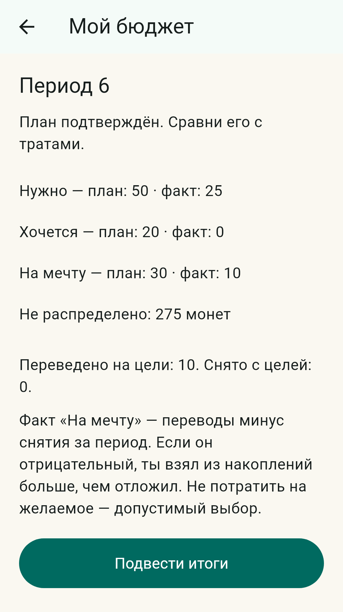

# Питомец Финни — презентация MVP

## 1. Учимся выбирать, заботясь о питомце

Для детей 7–11 лет. Android 8.0+, локальная игра без реальных платежей.

Проблема из ТЗ: ребёнок получает деньги раньше, чем умеет распределять их.
Абстрактное правило трудно связать со своим решением.

Идея: потратить на нужное, выбрать желаемое или отложить на мечту — и увидеть
понятное последствие для Финни.

Черновик защиты. Android-приёмка, подпись релиза и публикация материалов впереди.

## 2. Три образовательных направления

- Планирование: распределить ограниченную сумму и сравнить план с фактом.
- Покупки: выделить необходимое и проверить стоимость корзины.
- Сбережения: выбрать цель, сумму перевода и резерв на нужное.

Основа: рамка от 5 марта 2026 года, таблица для 7–11 лет, с. 1–4.
Это выбор отдельных результатов, не заявление об освоении всей рамки.

[Источник и авторское сопоставление](educational_basis.md).
Образовательный эффект пока не измерен.

## 3. Питомец связывает решение с результатом

- Доход периода — 100 игровых монет.
- Еда восстанавливает сытость, желаемые покупки меняют настроение.
- Сбережения отделены от доступного баланса.
- Три стадии: после 0, 2 и 4 подходящих периодов.

Период поддерживает рост, когда обеспечено нужное, расходы в пределах плана
и есть положительное пополнение не меньше запланированного.

Игрушку можно отложить. Ошибка не отнимает достигнутую стадию.

## 4. Один игровой цикл

1. Создать питомца и получить стартовые монеты.
2. Подтвердить три части бюджета.
3. Решить задание, выбрать покупки и пополнить цель.
4. Увидеть баланс, историю и план/факт.
5. Завершить период и объяснить результат.

Новый период начинается по кнопке: демонстрация не зависит от календаря.

Данные записываются атомарно. Отрицательные остатки и повторная награда
за одно задание не допускаются.

## 5. Объём реализованного MVP

- 9 вариантов внешности и 3 стадии роста.
- Этот файл — старый черновик слайдов, не использовать как финальное описание:
  каталог приложения содержит 21 товар; актуальные сведения — в README.
- История, подтверждения, справка и учебный прогресс.
- Отдельный тестовый профиль со сбросом.
- Раздел взрослого и удаление обычного профиля.

Нет сервера, аккаунтов, рекламы или настоящих денег.
Скриншоты отрисованы из реального Flutter UI, но это не фотографии телефона.

## 6. Интерфейс для ребёнка

- Нужное, желаемое и накопления подписаны словами, а не только цветом.
- Сумма и последствие показаны до подтверждения операции.
- Ошибка объясняется без стыда и потери заработанного прогресса.
- Есть настройка уменьшения движения; звуки не используются.
- Собственный масштабируемый рисунок питомца и иконка приложения.

В автотестах проверены описанные состояния на ширине 360 dp и масштабе ×1/×2.
TalkBack и удобство на физическом устройстве ещё нужно проверить.

## 7. Простая архитектура с границами

Экран → Riverpod-контроллер → контракт репозитория → реализация → Isar.

- Flutter и Dart — интерфейс и правила игры.
- Domain не зависит от виджетов или Isar.
- Профиль, история, задания и итоги меняются одной транзакцией.
- Покупки, цели, задания и справка поставляются в JSON.

Новое задание существующего типа добавляется данными; новый тип требует кода.
Будущий API можно подключить за репозиторием, но в MVP его нет.

## 8. Команда «КопиКот»

- Капитан: **Муратов Дмитрий, Python-разработчик**.
- Количество участников: **2 человека**.
- Кратко о решении: мобильная игра для детей 7–11 лет, которая учит планировать
  виртуальные монеты через заботу о питомце.
- Участники: Муратов Дмитрий — фрилансер; Алиса Чернышева — детский педагог.
- Город и регион: **Москва**.

Решение объединяет игровые задания, покупки и накопления: ребёнок видит не только
остаток монет, но и последствия своего выбора.

## 9. Что уже создано

- Android-приложение на Flutter работает с локальным профилем и сохраняет игру.
- Есть планирование бюджета, покупки, три цели накоплений, история и гардероб.
- Шесть финансовых заданий тренируют планирование, сравнение покупок и сбережения.
- В приложении есть демопрофиль для последовательной проверки игровых дней.

Коткоины виртуальные: платежей, рекламы и обязательной регистрации нет.
Основные возможности и незакрытые проверки описаны в [README](../README.md).

## 10. История команды

До хакатона мы уже были знакомы. В этом году решили участвовать вместе, потому
что предложенная задача показалась нам подходящей и интересной. Нас особенно
зацепила возможность сделать полезный продукт для детей — помочь им освоить
планирование и бережное отношение к деньгам в понятном игровом формате.

## 11. Коротко о решении

### Техническая суть

Flutter-приложение для Android хранит профиль и игровой прогресс локально,
работает без обязательного аккаунта и сети. Игровые правила проверяют бюджет,
покупки и награды; встроенный контент заданий и каталога отделён от интерфейса.

### Маркетинговая суть

«КопиКот» — игровое знакомство с финансовыми решениями для детей 7–11 лет.
Ребёнок помогает питомцу, выбирает нужные покупки, планирует желания и копит на
цель, а затем сравнивает план с результатом. Игра бесплатна и не использует
реальные деньги.
